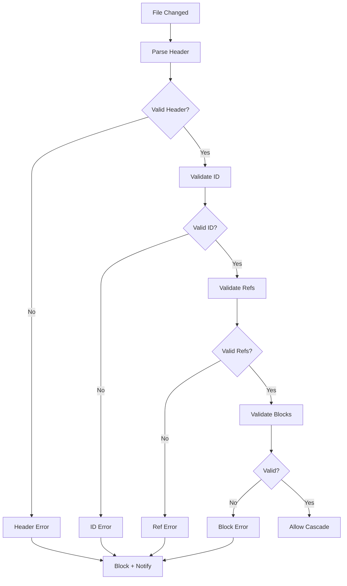

# speclang-header lines:8
id: "@speclang/validation"
version: 0.1.0
layer: 0
tags: [validation, schema, errors]
status: draft
---

# Validation

Spec validation rules. Checked on every write.

## Overview

```speclang
# @block:validation/overview @kind:note
Every spec is validated before it's written.

Validation happens:
- On file save (before cascade)
- On agent write (guard plugin)
- On explicit /validate command

Invalid specs block cascades and notify the agent.
```

---

## Header Validation

### @validation/header

```speclang
# @block:validation/header @kind:entity
HeaderValidation:
  line_1:
    - Must be comment or blank
    - Must match file type
    
  line_2:
    - Must contain "speclang-header"
    - Must declare line count
    - Format: "<comment> speclang-header lines:N"
    
  required_fields:
    - id: "@domain/path"
    - version: semver
    
  optional_fields:
    - parent: @ref
    - children: [@ref]
    - depends_on: [@ref]
    - refs: [@ref]
    - tags: [String]
    - short: String
    - target: String
    - status: enum
```

---

## ID Validation

### @validation/id

```speclang
# @block:validation/id @kind:entity
IdValidation:
  format: "@domain/path"
  
  rules:
    - Must start with @
    - Domain must be lowercase
    - Path uses forward slashes
    - No special chars except - and _
    
  examples:
    valid:
      - @specs/auth
      - @specs/auth/login
      - @generated/go/auth
      - @tests/auth/login
      
    invalid:
      - specs/auth          # missing @
      - @Specs/Auth        # uppercase
      - @specs/auth\login  # backslash
```

---

## Reference Validation

### @validation/refs

```speclang
# @block:validation/refs @kind:entity
RefValidation:
  format: "@ref:path#block-id"
  
  checks:
    - Target file must exist
    - Target block must exist (if specified)
    - No circular refs
    
  circular_detection:
    - Build dependency graph
    - Detect cycles
    - Error on circular dependency
```

---

## Block Validation

### @validation/blocks

```speclang
# @block:validation/blocks @kind:entity
BlockValidation:
  id:
    - Must be unique in file
    - Format: @block:domain/name
    
  kind:
    - Must be valid block kind
    - Valid: entity, operation, test, note, code, table, diagram
    
  content:
    - Must match block kind
    - Code blocks must be valid syntax
```

---

## Autonomous Validation

### @validation/autonomous

```speclang
# @block:validation/autonomous @kind:note
For specs with `agent_support: agent_autonomous`, additional validation
rules apply. See @ref:speclang/autonomous-validation for complete details.

Key additional checks:
- Step-by-step descriptions for all operations
- All references resolve to existing blocks
- No ambiguous natural language in critical sections
- Required metadata fields present and valid
- Completeness for given layer and project_level

Autonomous validation runs after standard validation passes.
Failure blocks cascade and may trigger downgrade to `agent_assisted`.
```

---

## Error Handling

### @validation/errors

```speclang
# @block:validation/errors @kind:entity
ValidationError:
  level: error | warning
  location: file:line:column
  message: String
  suggestion: String?
  
  on_error:
    - Log to .speclang/validation.log
    - Block cascade
    - Notify agent
    - Suggest fix
    
  on_warning:
    - Log only
    - Allow cascade
```

---

## Validation Flow

### @validation/flow

```speclang
# @block:validation/flow @kind:diagram

```
