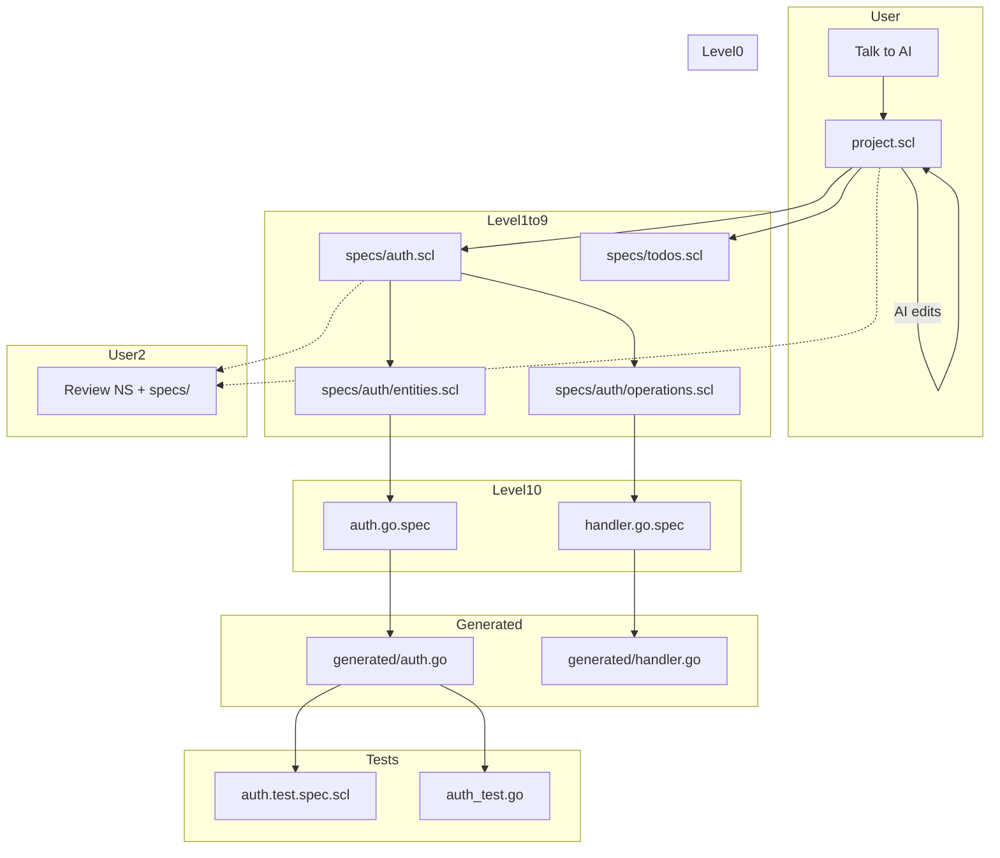

# speclang-header lines:12
id: "@speclang/workflow/examples"
version: 0.1.0
layer: 2
parent: "speclang/workflow"

tags: [workflow, examples, file-flow, team, troubleshooting]
status: draft
project_level: Alpha
agent_support: agent_assisted
short: Workflow Examples and Diagrams
---

## The File Flow

### @workflow/file-flow

```speclang
# @block:workflow/file-flow @kind:diagram

```

---

## Team Workflow

### @workflow/team

```speclang
# @block:workflow/team @kind:entity
TeamWorkflow:
  git_integration:
    - Specs are version controlled
    - Each convergence = commit
    - PRs review specs, not code
    
  collaboration:
    - Multiple developers = multiple cascades
    - File locks prevent conflicts
    - North star is shared intent
  
  review_process:
    - PR contains spec changes
    - Reviewer checks specs
    - Approve → merge → cascade on main
    - Generated code auto-committed
```

---

## Troubleshooting

### @workflow/troubleshooting

```speclang
# @block:workflow/troubleshooting @kind:entity
CommonIssues:
  
  cascade_stuck:
    symptom: No progress, files not changing
    fix: /status, check agent logs, /resume
    
  tests_failing:
    symptom: Pipeline fails on tests
    fix: AI auto-rolled back, check notification, fix spec
    
  conflict:
    symptom: Two agents want same file
    fix: Daemon serializes, may pause, check locks/
    
  wrong_output:
    symptom: Generated code doesn't match intent
    fix: Update spec, not code. Code regenerates.
```