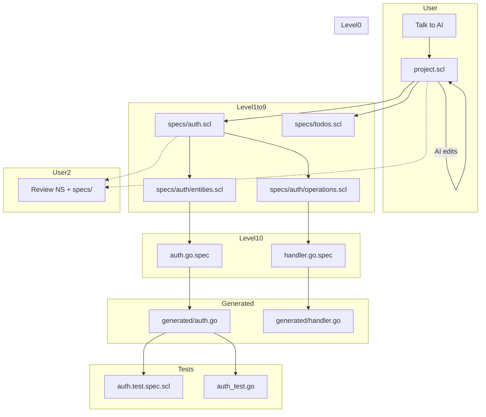

# speclang-header lines:9
id: "@speclang/workflow"
version: 0.1.0
layer: 0
tags: [workflow, user, guide, setup]
imports: ["@speclang/core", "@speclang/daemon", "@speclang/skills", "@speclang/cascade"]
status: draft

---

# User Workflow

How a user actually uses Speclang from start to finish.

## Overview

```speclang
# @block:workflow/overview @kind:note
The user's experience is simple:

1. Install once (binary + skills)
2. Start daemon
3. Talk to AI in natural language
4. Watch specs cascade into code
5. Review specs, not code
6. Ship

Everything else is automatic.
```

---

## Installation

### @workflow/install

```speclang
# @block:workflow/install @kind:operation
Install Steps:

1. Download speclangd binary:
   curl -sSL https://speclang.dev/install | sh
   
2. Download skills pack:
   speclang skills download
   
3. Point AI editor to skills:
   OpenCode: cp -r ~/.speclang/skills/* ~/.opencode/skills/
   Cursor: cp -r ~/.speclang/skills/* ~/.cursor/skills/
   Claude Code: cp -r ~/.speclang/skills/* ~/.claude/skills/
   
4. Done. No config needed.
```

### @workflow/install-detail

```speclang
# @block:workflow/install-detail @kind:entity
InstallArtifacts:
  binary:
    path: ~/.local/bin/speclangd
    size: ~5MB
    platforms: Linux, macOS, Windows
    
  skills:
    path: ~/.speclang/skills/
    contents:
      - SpecWriter/
      - CodeGen/
      - TestWriter/
      - BackSync/
      - Orchestrator/
    size: ~50KB total
    
  config:
    path: ~/.speclang/config.json
    defaults: auto-generated on first run
```

---

## Starting a Project

### @workflow/start

```speclang
# @block:workflow/start @kind:operation
Start Steps:

1. Create project directory:
   mkdir my-app && cd my-app
   
2. Initialize speclang:
   speclang init
   
3. Start daemon:
   speclangd start
   
4. Open AI editor with skills loaded

5. Say: "Build [description] using Speclang"

Done. Watch it build itself.
```

### @workflow/init-creates

```speclang
# @block:workflow/init-creates @kind:code
```
my-app/
├── project.scl        # north star (empty, ready for user)
├── specs/             # spec files (empty)
├── tests/             # test specs (empty)
├── generated/         # output code (empty, gitignored)
├── .speclang/         # daemon state
│   ├── config.json
│   └── locks/
├── .speclangrc        # project config
├── build.yaml         # pipeline config (default)
└── .gitignore
```
```

---

## The Conversation

### @workflow/conversation

```speclang
# @block:workflow/conversation @kind:entity
UserConversation:
  location: AI editor (OpenCode, Cursor, etc.)
  partner: Orchestrator agent (via skills)
  
  what_user_says:
    - "Build a Go API with auth"
    - "Add password reset"
    - "Use PostgreSQL instead of SQLite"
    - "Make it faster"
    - "Add rate limiting"
    
  what_ai_does:
    - Updates north star file
    - Triggers cascade
    - Expands specs
    - Generates code
    - Runs tests
    
  what_user_sees:
    - File changes in editor
    - Cascade log in terminal
    - Test results
    - Final generated code
```

### @workflow/conversation-example

```speclang
# @block:workflow/conversation-example @kind:code
```markdown
User: Build a Go REST API for a todo app with auth

AI: I'll create the north star file and start the cascade.
    [Writes to project.scl]
    [Cascade begins...]
    
    Created specs:
    - specs/auth.scl
    - specs/todos.scl
    - specs/api.scl
    
    Generated code:
    - generated/go/main.go
    - generated/go/auth/login.go
    - generated/go/todos/handler.go
    
    Tests:
    - tests/auth.test.spec.scl → auth_test.go
    - tests/todos.test.spec.scl → todos_test.go
    
    Running tests... ✓ All 12 tests passed
    
    Converged. Ready for next instruction.

User: Add rate limiting to the API

AI: I'll add rate limiting to the auth module.
    [Updates specs/auth.scl]
    [Cascade continues...]
    
    Updated:
    - specs/auth.scl (added rate-limit policy)
    - generated/go/auth/middleware.go (new)
    
    Tests: +3 new tests, all passing
    
    Converged.
```
```

---

## What User Reviews

### @workflow/review

```speclang
# @block:workflow/review @kind:entity
UserReviews:
  what_to_review:
    - project.scl (north star)
    - specs/core/*.scl (level 0 specs)
    - Any spec the user wants to understand
    
  what_NOT_to_review:
    - generated/**/* (machine code)
    - specs/expanded/**/* (AI-generated details)
    - tests/*.test.spec.scl (AI-generated tests)
    
  philosophy:
    - Review intent, not implementation
    - Specs are the source of truth
    - Generated code is like compiled output
```

### @workflow/review-commands

```speclang
# @block:workflow/review-commands @kind:code
```markdown
User: Show me what changed

AI: Changes since last convergence:
    
    Specs modified:
    - specs/auth.scl (+15 lines)
      Added: @block:auth/rate-limit
    
    Code generated:
    - generated/go/auth/middleware.go (new)
    - generated/go/auth/login.go (+8 lines)
    
    Tests added:
    - tests/auth/rate-limit.test.spec.scl (new)

User: Show me the auth spec

AI: [Displays specs/auth.scl content]
    
    Want me to explain any part?

User: Why did we add rate limiting?

AI: You asked to "Add rate limiting to the API".
    I added a policy to auth.scl that limits requests
    per IP to 100/minute.
```
```

---

## The File Flow

### @workflow/file-flow

```speclang
# @block:workflow/file-flow @kind:diagram

```

---

## Commands

### @workflow/commands

```speclang
# @block:workflow/commands @kind:entity
UserCommands:
  spoken_to_ai:
    "Build [feature]"      → start new feature
    "Add [capability]"     → extend existing
    "Change [setting]"     → modify config
    "Fix [issue]"          → address problem
    "Explain [block]"      → understand spec
    
  typed_in_north_star:
    /finalize              → force convergence + commit
    /pause                 → pause cascade
    /resume                → resume cascade
    /status                → show cascade state
    /rollback              → undo last changes
    /build                 → run pipeline manually
```

---

## Daily Workflow

### @workflow/daily

```speclang
# @block:workflow/daily @kind:note
Typical day with Speclang:

Morning:
1. Open project, daemon running
2. "Show me what we're building"
3. Review north star, maybe tweak

Development:
4. "Add [feature]"
5. Watch cascade
6. Review generated specs (optional)
7. Tests pass automatically

Review:
8. "What changed today?"
9. Review spec diff
10. Approve or adjust

End of day:
11. /finalize
12. Commit pushed
13. Done
```

---

## Team Workflow

### @workflow/team

```speclang
# @block:workflow/team @kind:entity
TeamWorkflow:
  git_integration:
    - Specs are version controlled
    - Each convergence = commit
    - PRs review specs, not code
    
  collaboration:
    - Multiple developers = multiple cascades
    - File locks prevent conflicts
    - North star is shared intent
    
  review_process:
    - PR contains spec changes
    - Reviewer checks specs
    - Approve → merge → cascade on main
    - Generated code auto-committed
```

---

## Troubleshooting

### @workflow/troubleshooting

```speclang
# @block:workflow/troubleshooting @kind:entity
CommonIssues:
  
  cascade_stuck:
    symptom: No progress, files not changing
    fix: /status, check agent logs, /resume
    
  tests_failing:
    symptom: Pipeline fails on tests
    fix: AI auto-rolled back, check notification, fix spec
    
  conflict:
    symptom: Two agents want same file
    fix: Daemon serializes, may pause, check locks/
    
  wrong_output:
    symptom: Generated code doesn't match intent
    fix: Update spec, not code. Code regenerates.
```
